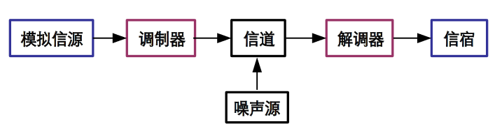
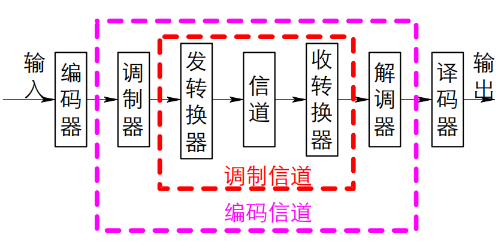
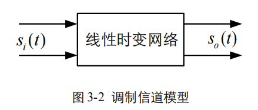

# 通信原理_西安电子科技大学_曹丽娜

[【西安电子科技大学】通信原理（全48讲）曹丽娜](https://www.bilibili.com/video/BV19c411g7V2/?spm_id_from=333.337.search-card.all.click&vd_source=9bb1eb433b56a116bb5fb167cdfc155e)

## 第一章绪论

### 消息、信息与信号(信使三姐妹)

- 信息：消息的内涵，即信息中包含的有效内容。

- 消息：信息的物质载体，信息的外在表现形式。通信系统要传输的对象，具有多种形式。
  - 同样的信息，可用不同形式的消息来表示。
  - 连续消息：语音、温度、活动图片。
  - 离散消息：数据、符号、文字等。

- 信号：消息的电表示形式，消息的物质 / 传输载体。
  - 模拟信号：信号参量取值连续(不可数，无限个)
  - 数字信号：信号参量取值离散(可数，有限个)

- 消息、信息和信号的关系：
  - 消息是信息的物理表现形式；
  - 信息是消息的内涵；
  - 信号是消息的传输载体。

#### 模拟信号与数字信号

- 模拟信号：
  1. 连续性：模拟信号在时间和幅度上都是连续的，意味着信号可以取任何数值，并且在时间轴上没有间断。
  2. 无限值域：由于连续性，模拟信号的幅度可以是无限多个值。
  3. 真实世界表示：模拟信号通常用来表示自然界中真实的、连续变化的现象，如声音、温度或压力。
  4. 信号形式：常见的模拟信号包括正弦波、方波、三角波、锯齿波等。
  5. 传输与处理：模拟信号可以直接在介质中传播，如空气、电线或光纤，但容易受到噪声和失真的影响。

- 数字信号：
  1. 离散性：数字信号在时间和幅度上都是离散的，意味着信号在时间上由一系列分离的点组成，每个点的幅度也只限于几个特定的数值。
  2. 有限值域：数字信号的幅度只能取有限个数值，最常见的是二进制信号，只有两个状态：“0”和“1”。
  3. 人为抽象：数字信号是人为设计的信号，用于处理和存储信息，如计算机数据、数字音频和视频。
  4. 信号形式：数字信号包括二进制序列、脉冲编码调制（PCM）、数字脉冲调制（PWM）等。
  5. 抗噪性：数字信号在传输过程中对噪声有较强的抵抗能力，因为它们可以再生和校正。

- 实践中区分模拟信号与数字信号
  1. 观察波形：模拟信号的波形通常是平滑的曲线，而数字信号的波形看起来像是阶梯状或方波。
  2. 使用示波器：通过示波器观察信号，模拟信号会显示为连续变化的波形，而数字信号则显示为在几个固定电平之间跳跃的波形。
  3. 测量幅度：模拟信号的幅度可以是任何数值，而数字信号的幅度会被限制在几个特定的电平上。

举例：

1. 连续函数
   - 模拟信号：连续函数代表了在时间上和幅度上都连续变化的信号，这符合模拟信号的定义。连续函数能够取无限数量的值，而且在时间轴上没有间断点。
2. 抽样信号
   - 介于模拟和数字之间：抽样信号是通过从连续信号中提取离散时间点的值而得到的。如果仅进行了时间上的离散化（即抽样），而未进行幅度上的量化，则抽样信号仍然被认为是模拟信号，因为它在幅度上仍然是连续的。然而，当抽样信号进一步通过量化变为离散幅度时，它就变成了数字信号。
3. 二电平信号
   - 数字信号：二电平信号具有两个幅度电平，通常表示为逻辑“0”和“1”。这种信号的幅度被限制在两个特定的值，符合数字信号的定义，即信号的幅度取值是离散的，且通常受限于有限个数值。
4. 二相位信号
   - 数字信号：二相位信号是指信号的相位在两个可能的状态之间切换，通常用于数字调制技术，比如二相移键控（BPSK）。尽管相位的变化可能是连续的，但二相位信号的相位状态只有两种，这使得它符合数字信号的定义，即信号的状态是离散的。

#### 区分模拟信号与数字信号

- 模拟存储
  - 存储介质：模拟音频通常存储在磁带、黑胶唱片或磁性介质上。
  - 信号类型：模拟信号是连续的电信号，它直接反映了原始音频的波形。
  - 存储大小：模拟音频的存储容量受限于物理介质的尺寸和材质，例如，磁带的长度和质量决定了它可以存储多少音频。
  - 保真度：模拟存储的保真度受制于噪声、磨损和介质老化的影响，每次复制都会造成质量损失，即所谓的“代际损失”。
  - 处理与编辑：模拟音频的处理和编辑较为复杂，通常需要专门的硬件设备，如磁带录音机或混音台。

- 数字存储
  - 存储介质：数字音频存储在硬盘、闪存、CD、DVD或其他数字存储介质上。
  - 信号类型：数字信号是通过采样和量化音频波形转换成二进制数字格式的信号。
  - 存储大小：
    - 数字音频的大小取决于采样率、量化位数和声道数。
    - 例如，一个44.1 kHz采样率、16位量化、立体声的音频文件，每秒大约需要705.6 KB的数据量（未压缩）。
    - 压缩技术，如MP3或AAC，可以显著减少文件大小，但可能会牺牲音频质量。
  - 保真度：数字音频理论上可以无损地无限次复制，因为每次复制都是二进制数据的完美复制，除非有错误引入。
  - 处理与编辑：数字音频易于在软件中进行非破坏性编辑和处理，可以轻松实现剪切、复制、粘贴和效果应用等功能。

- 性能比较
  - 抗噪性和耐用性：数字信号通常具有更好的抗噪性和耐用性，因为它们不受物理磨损的影响。
  - 可扩展性和兼容性：数字信号更容易通过网络共享和传输，具有更好的可扩展性和兼容性。
  - 编辑和后期制作：数字音频提供了更高级的编辑和后期制作选项，包括多轨录音、音效添加和自动修复等。
  - 存储效率：虽然单个未压缩的数字音频文件可能比模拟存储介质大，但数字压缩技术允许在相对较小的空间内存储大量音频。
  - 音质：音质是一个主观话题，一些人偏好模拟音频的温暖和自然感，而其他人则欣赏数字音频的清晰度和一致性。

#### 如何将消息转换为电信号？

消息 <=> 电信号的转换，可由传感器等来实现。

- 话筒（声音传感器）把声音转变成音频信号；
- 数字终端把符号转变成数字信号；
- 摄像机把图像转变成视频信号；
- 热敏电阻（温度传感器）把温度转变成电信号。

#### 信使三姐妹归纳

**通信**：利用**电信号**传输**消息**中所包含的**信息**。

### 通信的历程

- 电报：1837年，莫尔斯发明了有线电报，开创了电信新时代。——**数字通信的开始**
- 电话：1876年，贝尔发明了有线电话——模拟通信的先驱
- 电磁波：
  - 1864年，麦克斯韦预言电磁波的存在，1887年赫兹实验证实。——**传递信息的无形信使**
  - 1901年，马可尼利用电磁波，实现横跨大西洋的无线电报通讯，使**无线电进入实用阶段**。
  - 1906年，德弗雷斯特发明真空三极管，使无线电通信获得普及应用。——“**空中帝国的王冠**”
- 广播：
  - 1918年，阿姆斯特丹发明了超外差接收机，调幅(AM)无线电广播问世。
- 电视：
  - 1936年，英国广播公司(BBC)开播。
  - 1948年，香农发表了信息论的奠基之作《通信的数学理论》，推动了整个**通信领域的数字化革命**。

- 1961~1970，立体声调频广播(1961)；集成电路；**卫星通信**步入实用阶段。
- 1970~1980，演示蜂窝电话系统；个人计算机出现；大规模IC时代到来；**光纤通信**系统投入商用。
- 1981~1990：IBM PC机出现；传真机广泛使用；卫星全球定位系统(**GPS**)完成部署(1989)
- 2001~至今：基于微处理器的数字信号处理；物联网(2008)；数字电视及个人通信时代到来；3G、4G、5G；量子通信
- 2018.2.26：世界移动通信大会(主题：创造更美好的未来)，在西班牙巴塞罗那举行。带来了5G技术、物联网、人工智能、大数据和云计算等领域的最新成果。
- 2019：5G商用舞台(主题：“智联万物”)的巨幕正在徐徐拉开，**中国华为**走在了世界前列。

### 通信的意义

- 通信的**目的**在于**传输信息**。

- 信息的意义：
  - 信息就是信息，既非物质，也非能量。—— Wiener(控制论奠基人)《控制论与社会》1950
    - 信息的意义和重要性与物质和能量并驾齐驱。
    - 即信息(Informaton)、物质(Substance)和能量(Energy)是构成物质的三大要素(三足鼎立，相互依存，缺一不可)。
    - 信息要借助于物质和能量才能产生、传输、存储、处理和感知。
    - 物质和能量要借助于信息来表述和控制。
    - 没有物质的世界是虚无的，没有能量的世界是死寂的，没有信息的世界是混乱的。
  - 信息是用来消除随即不确定的东西。——Shannon(信息论创始人)《通信的数学理论》
  - 信息的**价值**在于**传播**，而非信息本身。——通信
    - 人类感知信息、传递信息和利用信息，来认知世界和改造世界。
    - 通信正在深刻改变人类的生活方式。
    - 通信对经济、文化、教育、军事、政治产生重大变革和深远影响。

经典理解：

- 通信就是利用电信号传输消息中所包含的信息。
- 完成通信过程所需的电子设备和信道的总体 —— 通信系统(communication system)

### 通信系统的组成（模型）

#### 通信系统的一般模型

通信系统——实现通信(信号的传输、发送、传输、接收和恢复)过程所需的一切技术设备(包括信道)的总体。

- 麦克风把声音->音频信号，发射机把音频信号放大调制产生条幅信号并耦合到发射天线。天线把调幅信号感应成可以辐射到大气层中的电磁波(即无线电波)，无线电波经过无线信道传输到达接收端，接收天线把电磁波转换为调幅信号，收音机(即接收设备)将调幅信号解调还原为音频信号，再经音频信号功放后驱动扬声器还原为声音。
- 实现了从广播电台到听众的消息传递。

- 信源：
  - 信源是消息的产生地，其作用是把各种消息转换成原始电信号，称之为消息信号或基带信号。
  - 把消息 → 电信号，如 电话机的话筒**把声音→音频信号**
  - 电话机、电视摄像机和电传机、计算机等各种数字终端设备就是信源。
- 发送设备：
  - 发送设备的基本功能是将信源和信道匹配起来，即将信源产生的消息信号变换成适合在信道中传输的信号。
  - 原始电信号→适合在信道中传输的信号。如 编码、调制。
- 信道：噪声源
  - 信道是指传输信号的物理媒质。在无线信道中的，信道可以是大气（自由空间），在有线信道中，可以是明线、电缆、光纤。
  - 噪声源不是人为加入的设备，而是通信系统中各种设备以及信道中所固有的，为了分析方便，把噪声源视为各处噪声的集中表现而抽象加入到信道。
- 接收设备：
  - 接收设备的基本功能是完成发送设备的反变换，即进行解调、译码、解码等等。它的任务是从带有干扰的接收信号中正确恢复出相应的原始基带信号来。
  - 功能与发送设备相反。如 译码、解调
- 信宿：
  - 信宿是传输信息的归宿点，其作用是将复原的原始信号转换成相应的消息。
  - 把电信号 → 消息，如 电话机的听筒把音频信号→声。

>上图概括地描述了一个通信系统的组成，它反映了通信系统的共性，因此称之为通信系统的一般模型。根据研究的对象以及所关注的问题不同，有不同形式的更具体的通信模型。

按照信道中传输的是模拟信号还是数字信号，相应地把通信系统分为**模拟通信系统**和**数字通信系统**。

#### 模拟通信系统

信源发出的原始电信号是**基带信号**，由于这种信号具有频率很低的频谱分量，一般不宜直接传输，这就需要把基带信号变换成其频带适合在信道中传输的信号，并在接收端进行反变换。完成这种变换和反变换的通常是调制器和解调器。经过调制以后的信号称为**已调信号**。

**已调信号有三个基本特征**：一是携带有信息，二是适合在信道中传输，三是信号的频谱具有带通形式且中心频率远离零频，因而已调信号又称**频带信号**。

- 研究：
  - 基带传输：模拟消息 <=> 消息信号/原始电信号(基带信号) —— 频谱位于零频附近
  - 带通传输/频带传输/调整传输：基带信号 <=> 已调信号(带通信号)

#### 数字通信系统

- 信源编码：
  - 模/数转换
  - 压缩编码，提高有效性
  - 类似于棉花抽真空
- 信道编码：
  - 冗余编码
  - 增强抗干扰能力
  - 把玻璃杯包装，以免破碎
- 调制：把信息寄托到载波上
  - 如同让乘客坐上飞机，给电波插上翅膀。
- 解调：从已调信号中还原信息。
  - 如同让乘客下飞机。

数字调制解调的核心内容：**编码、译码、调制、解调、同步**

#### 数字通信的特点

- 优点：
  - 抗干扰能力强，且噪声不积累；
  - 传输差错可控；
  - 便于处理、变换、存储；
  - 便于将来自不同信源的信号综合传输；
  - 易于集成；易于加密。
- 缺点：
  - 可能需要较大的传输带宽；
  - 对同步要求高。

### 通信系统的分类

- 按信道信号特征分类：
  - 模拟通信
  - 数字通信
- 按传输媒质分类
  - 有线通信
  - 无线通信
- 按传输方式分类
  - 基带传输
  - 带通传输
- 按通信业务分类
  - 电话
  - 数据
  - 图像通信
- 按工作波段分类
  - 长波
  - 中波
  - 短波
  - 微波
  - 红外
  - 激光通信
- 复用方式
  - 频分
  - 时分
  - 码分复用

### 通信方式

- 按传输方向和时间划分
  - 单工通信（单向）
  - 半双工通信（双向、不同时）
  - 全双工通信（双向、同时）

- 按码元传输时序划分
  - 并行传输：在并行信道上同时传输 n 个比特信息。
    - 优点：节省传输时间，速度快：
    - 缺点：需要n条通信线路，成本高
    - 应用：设备之间的近距离通信，例如：计算机和打印机之间数据的传输。
  - 串行传输 ：数字码元序列按时间顺序一个接一个地
    - 优点：成本比并行传输的低，只需一条通信信道，
    - 缺点：速度慢、需要外加同步措施。
    - 应用：远距离的通信。

### 信息的度量

#### 理解信息

- **通信**的**目的**在于**传输消息**中所包含的*信息*。
- 消息中**不确定的内容**才构成信息。**信息量**就是对这种**不确定性**的**定量描述**。
- 信息具有**普遍存在性**（即存在于任何事物的运动和变化中）；
  - 可扩充或压缩性；
  - 可存储与传输性；
  - 相对性（不同的认识主体观察到的信息不同）；
  - 可度量、可共享和时效性（信息具有“生命周期”）。
- 在当今信息社会中，信息是最宝贵的资源之一。
- **信息必须依附于一定的物质形式存在**，这种**承载信息的物质就是消息**。例如：
- 利用语言（消息）交流信息；
- 击鼓传令，是利用鼓声（消息）传递作战信息；
- 通过信件（文字消息）向远方的亲人互报平安；
- 天气预报电视节目中可用“太阳图标”或“云和雨滴图标”（消息） 来表示晴天或雨天的信息
- 同样的信息可用不同形式的消息来表述。

#### 信息量

- 确定事件：概率`P = 1`
- 不确定性少：概率`P`大
- 不确定性多：概率`P`小

- 信息量就是**不确定性**的多少。
- 信息量可用**概率(可能性)**来度量。

- 信息量$I$是概率$P(x)$的函数：$I=f[P(x)]$

$
I = log_a \frac{1}{P(X)} = -log_a P(X)
$

a = 2，比特(bit)，s简记为b
a = e，奈特(nat)
a = 10，哈特莱(Hartkey)

举例：

二进制信源等概独立发送信号时，每个符号的信息量
$I_0 = I_1 = log_2 \frac{1}{P(X)} = log_2 2 = 1 b$

二进制的每个码元含`1bit`
四进制的每个码元含`2bit`
M进制的每个码元含 $log_2 M = K bit$

**总结**：

- 概率不同时，信息量也不相同。
- 概率越小(不确定性大)的符号，其信息量越大
- $I_i$反映了单个符号$x_i$的不确定性，但不能反映整个信源的不确0.定性。

#### 信源熵-H-平均信息量

设有**M个**符号的离散信源：

$
\begin{pmatrix}
x_1, & ..., & x_i, & ..., & x_m\\
P(x_1), & ..., & P(x_2), & ..., & P(x_m)
\end{pmatrix}
$

且

$
\sum_{i}^{M}
P(X_i) = 1
$
**独立统计**
则信源中每个符号的平均信息量——熵：
$H = E[I(X_i)] = E[log_2 \frac{1}{P(X_i)}]$
即
$H = \sum_{i=1}^{M} P(X_i) log_2 \frac{1}{P(X_i)}$
**概率加权的统计平均值**

#### 信息的度量总结

X_i的信息量(b)：$I_i = I(X_i) = log_2 \frac{1}{P(X_i)}$ 反映**单个符号**的**不确定性**

平均信息量(信源熵)(b/sym)：$H = \sum_{i=1}^{M} P(X_i) log_2 \frac{1}{P(X_i)}$ 反映**信源**的**平均不确定性**

- H与信源的进制数和各符号出现的概率有关：
- M一定、P相等时，熵最大：$H_{max} = log_2 M = I_i$
- 发送概率P相等时：信源的进制数越多，熵越大。
- 借助熵的概念：$I_总 = n * H$

### 主要性能指标

有效性 <= 性能指标 => 可靠性
关系：矛盾、关联、互换

模拟通信：

- 传输带宽
- 输出信噪比

数字通信：

- 传输速率、频带利用率
- 差错概率

#### 数字通信系统的有效性指标

##### 码元传输速率 $R_B$ （传码率、波特率）

- 定义：每秒传送的码元个数。
- 单位：波特（ Baud ）
- 计算：若一个码元的时间长度（码元长度）为 $T_s$ 秒，则$R = \frac{1}{T_s}$

例如： 1 秒内传输 1000 个码元，则 $R_B =1000 Baud$

##### 信息传输速率 $R_b$ (传信率，比特率)

- 定义：每秒传递的比特数（信息量）。
- 单位：比特 / 秒（ bit/s ）简记为 b/s 或 bps

##### 频带利用率——把 B 与 传输速率 联系起来

- 定义为单位带宽内的传输速率，即
$\eta = \frac{R_B}{B} (Baud/Hz)$

$\eta_b = \frac{R_b}{B} (bps/Hz)$

其中：$R_b = R_B * log_2 M$
$\eta_b = \eta * log_2 M$

#### 数字通信系统的可靠性指标

##### 误码率$P_e$

$P_e = \frac{错误码元数}{传输总码元数} = \frac{N_e}{N}$

##### 误信率(误比特率)$P_b$

$P_b = \frac{错误比特数}{传输总比特数} = \frac{I_e}{I_b}$

- 二进制：$P_B = P_e$
- M进制：$P_B <> P_e$

## 第二章 随机过程

### 随机过程

**确定性过程**：变化过程具有确定的形式，或者说具有必然的变化规律，用数学
语言来说，其变化过程可以用一个或几个时间t 的确定函数来描述，这类过程称
为确定性过程。例如，电容器通过电阻放电时，电容两端的电位差随时间的变
化就是一个确定性函数。

**随机过程**：另一类过程没有确定的变化形式，也就是说，每次对它的测量结果没有
一个确定的变化规律，用数学语言来说，这类事物变化的过程不可能用一个或
几个时间t 的确定函数来描述，这类过程称为随机过程。可用函数 f(x, t) 描述，
x 为随机变量。

#### 随机过程的统计特性

- **数学期望**：$a(t) = E[\xi(t)] = \int_{-\infty}^{\infin} xf(x, t)dx$
  - 其中 $f(x, t)$ 是概率密度函数，$a(t)$ 是时间 $t$ 的函数，它表示随机过程的 $n$ 个样本函数曲线的摆动中心。

- **方差**：$D(\xi(t)) = E[(\xi(t) - a(y))^2] = E[\xi^2(t)] - a^2(t)$
  - 它表示随机过程在时刻 $t$对于均值 $a(t)$ 的偏离程度

- 均值和方差描述了随机过程在各个孤立时刻的特征，为了描述随机过程在两个不同时刻状态之间的联系，还需利用二维概率密度引入新的数字特征。

- **自相关函数**：$R(t_1, t_2) = E(\xi(t_1)\xi(t_2)) = \int_{-\infty}^{\infty}\int_{-\infty}^{\infty} x_1 x_2 f_2(x_1, x_2, t_1, t_2)dx_1 dx_2$
是衡量同一过程的相关程度的，因此，又常分别称为自相关函数。

- **自协方差函数**：$B(t_1, t_2) = E(\xi(t_1) - a(t_1))(\xi(t_2) - a(t_2)) = \int_{-\infty}^{\infty}\int_{-\infty}^{\infty} [x_1 - a(t_1)][x_2 - a(t_2)]  f_2(x_1, x_2, t_1, t_2)dx_1 dx_2$

- 二者关系为：$B(t_1, t_2) = R(t_1, t_2) - a(t_1)a(t_2)$
  - 当 a(t)=0 时：$B(t_1, t_2) = R(t_1, t_2)$
  - 若$t_2 > t_1$，令$t_2 = t_1 + \tau$ 则有 $R(t_1, t_2) = R(t_1, t_1 + \tau)$

- 对于两个或更多个随机过程，可引入互协方差及互相关函数。

- 设 $\xi(t)$ 和 $\eta(t)$分别表示两个随机过程

- 互协方差函数：$B_\xi\eta (t_1, t_2) = E{[\xi(t_1) - a_\xi(t_1)][\eta(t_2) - a_\eta(t_2)]}$

- 互相关函数：$R_\xi\eta(t_1, t_2) = E[\xi(t_1)\eta(t_2)]$

### 平稳随机过程

**平稳随机过程**，是指它的统计特性不随时间的推移而变化，具体到它的一维分布，则与时间t 无关，而二维分布只与时间间隔t 有关。

**重要性质**：平稳随机过程 $\eta(t)$ 具有“**平稳**”的数字特征，它的均值与时间无关，为常数$a(t) = C$；它的自相关函数只与时间间隔 t 有关，即$R(t_1, t_2) = R(\tau) \tau = t_1 - t_2$

#### 严平稳随机过程(狭义平稳)

用符号化语言表示出来，即：
如果对于任意的n（n=1,2,···），t1,t2,···,tn∈T和任意实数h，
当t1+h,t2+h,···,tn+h∈T时，n维随机变量（X(t1),X(t2),···,X(tn)）和（X(t1+h),X(t2+h),···,X(tn+h)）具有相同的分布函数，则称随机过程{X(t),t∈T}具有平稳性，称此过程为严平稳随机过程，简称随机过程。
若随机过程严格平稳，则可以得出以下结论：
其数学期望、方差与时间无关，自相关函数仅与时间间隔有关。

#### 宽平稳随机过程(广义平稳)

严平稳随机过程的定义式，要求对于所有的 n 均成立，在实际应用中很复杂。引入另外一种平稳随机过程的定义：
一个二阶矩随机过程，它的均值为常数，自相关函数仅是时间间隔的函数，则称它为宽平稳随机过程或广义平稳随机过程。

给定二阶矩过程{X(t),t∈T}，如果对任意的t,t+h∈T,有
（1）E[X(t)]=Cx（常数） （2）E[X(t)X(t+h)]=R(h)
则称{X(t),t∈T}为宽平稳（随机）过程或广义平稳（随机）过程 [3]。
注：二阶矩过程定义：如果随机过程{X(t),t∈T}对每一个t∈T，二阶矩E[X(t)·X(t)]都存在，那么称它为二阶矩过程。
要证明某个随机过程是否是宽平稳过程（广义平稳过程）就必须的满足以上定义中的三个条件：
（1）E[X(t)]=Cx（常数）
（2）E[X(t)X(t+h)]=R(h)
（3）E[X^2(t)] < +∞

一个严平稳随机过程只要它的均方值 $E[\xi^2(t)]$有界，则它必定是广义平稳随机过程，但反过来一般不成立。

通信系统中所遇到的信号及噪声，大多数可视为平稳的随机过程。以后讨论的随机过程除特殊说明外，均假定是平稳的， 且均指广义平稳随机过程，简称平稳过程。

#### 区别联系

严平稳随机过程与宽平稳随机过程区别联系
（1）一个宽平稳过程不一定是严平稳过程，一个严平稳过程也不一定宽平稳过程。
（2）宽平稳过程定只涉及与一维、二维分布有关的数字特征，所以一个严平稳过程只要二阶矩存在，则必定是宽平稳过程。但反过来，一般是不成立的。
（3）正态过程是一个重要特例，一个宽平稳的正态过程必定是严平稳的。
这是因为：正态过程的概率密度是由均值函数和自相关函数完全确定的，因而如果均值函数和自相关函数不随时间的推移而变化，则概率密度函数也不随时间的推移发生变化。

#### 各态历经性( 遍历性)

事实证明：如果一个平稳随机过程，只要满足一些较宽的条件，则一个样本函数在整个时间轴上的平均值可以用来代替其集平均（统计平均值和自相关函数等），这就是各态历经性。
一般来说，在一个随机过程中，不同样本函数的时间平均值是不一定相同的，而集平均则是一定的。因此，一般的随机过程的时间平均≠集平均，只有平稳随机过程才有可能是具有各态历经性的。即各态历经的随机过程一定是平稳的，而平稳的随机过程则需要满足一定条件才是各态历经的。

随机过程的任一实现，**经历**了随机过程的**所有可能状态**。

- 随机过程的**统计平均**特性，可以由其任一实现 (样本函数) 的**时间平均**特性来代表。

#### 平稳随机过程自相关函数的性质

1. 对于平稳随机过程而言，它的自相关函数是特别重要的一个函数。
   1. 其一，平稳随机过程的统计特性，如数字特征等，可通过自相关函数来描述；
   2. 其二，自相关函数与平稳随机过程的谱特性有着内在的联系。
2. 主要性质
   1. 平均功率：$R(0) = E[\xi^2(t)] = S$
   2. 直流功率：$R(∞) = E^2[\xi(t)]$
      1. 这里利用了$R(∞) = \begin{aligned} \lim_{\tau\to \infty} E[\xi(t)\xi(t+\tau)] \end{aligned}$
   3. 偶函数：$R(\tau) = R(-\tau)$
   4. 上界：$|R(\tau)| <= R(0)$
   5. 交流功率：$R(0) - R(∞) = \tau^2$

#### 平稳随机过程的功率谱密度

随机过程的频谱特性是用它的功率谱密度来表述的。它的功率谱密度 $P_\xi(\omega)$ 与其自相关函数 $R(\tau)$ 是一对傅里叶变换关系,即
$P_\xi(\omega) = \int_{-\infty}^{\infty} R(\tau)e^{-j\omega\tau}$
$P(\tau) = \frac{1}{2\pi} \int_{-\infty}^{\infty} P_\epsilon(\omega)e^{j\omega\tau}d\omega$

### 高斯随机过程

#### 高斯随机过程定义

若随机过程 $\xi(t)$ 的任意n 维（n = 1,2,...）分布都是正态分布，则称它为**高斯随机过程**或**正态过程**。高斯过程在任一时刻上的样值是一个一维高斯随机变量，其一维概率密度函数可表示为
$f(x) = \frac{1}{\sqrt{2\pi\sigma}} exp(-\frac{(x-a)^2}{2\sigma^2})$

#### 重要性质

- 高斯过程的 n 维分布完全由 n 个随机变量的数学期望、 方差和两两之间的归一化协方差函数所决定。因此，对于高斯过程，只要研究它的数字特征就可以了。
- 广义平稳的高斯过程也是狭义平稳的。
- 如果高斯过程在不同时刻的取值是不相关的，那么它们也是统计独立的。
- 高斯过程经过线性变换（或线性系统）后的过程，仍是高斯过程。
- 若干个高斯过程的代数和仍是高斯过程。

#### 高斯白噪声

- 白噪声——它的功率谱密度均匀分布在整个频率范围内，即$P_\xi(\omega) = \frac{n_0}{2}$
  - 是一个理想的宽带过程。
  - $n_0$ 为一常数，单位是瓦 / 赫
- 白噪声是平稳随机过程
  - 白噪声只有在 $\tau = 0$ 时才相关，而它在任意两个时刻上的随机变量都是互不相关的。
- 高斯白噪声
  - 如果白噪声又是高斯分布的，我们就称之为高斯白噪声。
  - 高斯白噪声在任意两个不同时刻上的取值之间，不仅是互不相关的，而且还是统计独立的。

### 随机过程通过线性系统

通信的目的在于传输信号，信号和系统总是联系在一起的。通信系统中的信号或噪声一般都是随机的，因此在以后的讨论中我们必然会遇到这样的问题：**随机过程通过系统（或网络）后，输出过程将是什么样的过程？**
这里，我们只考虑平稳过程通过线性时不变系统的情况。随机信号通过线性
系统的分析，完全是建立在确知信号通过线性系统的分析原理的基础之上的。我
们知道，线性系统的响应 $v_0(t)$等于输入信号 %v_i(t)% 与系统的单位冲激响应 $h(t)$ 的卷积，即
$v_0(t) = v_i(t)*h(t) = \int v_i(t) * h(t-\tau)dt = \int h(t)*v_i(t-\tau)dt$
若$V_0(t) V_0(\omega)$,$V_i(t) V_i(\omega)$,$h(t) H(\omega)$，则有$V_0(\omega) = v_i(\omega)·H(\omega)$

$\xi_0(t)$的自相关函数只依赖时间间隔t 而与时间起点t_1无关。由以上输出过程的数学期望和自相关函数证明，**若线性系统的输入过程是平稳的，那么输出过程也是平稳的**。

### 窄带随机过程

- 是随机过程通过窄带系统的输出。
- 窄带条件：
  1. $\Delta f << f_c$
  2. $f_c远离零频$
- 窄带：$\frac{\Delta f}{f_c} < 1%$
- 宽带：$1\%$ 至$20\%$
- 超宽带：$>20\%$

- 实例——包络缓慢变化的正弦波
- 实际中，大多数通信系统都是窄带型的，通过窄带系统的信号或噪声必是窄带的，如果这时的信号或噪声又是随机的，则称它们为窄带随机过程。

$结论$

- 一个均值为零的窄带平稳高斯过程
  - 它的同相分量和正交分量也是平稳高斯过程。而且均值都为零，方差也相同。
  - 此外，在同一时刻上得到的和是互不相关和或统计独立的。
  - 其包络的一维分布是瑞利分布，而其相位的一维分布是均匀分布，并且就一维分布而言，包络和相位是统计独立的。

### 正弦波加窄带随机过程

- 信号经过信道传输后总会受到噪声的干扰，为了减少噪声的影响，通常在接收机前端设置一个带通滤波器，以滤除信号频带以外的噪声。
- 因此，带通滤波器的输出是信号与窄带噪声的混合波形。
- 最常见的是正弦波加窄带高斯噪声的合成波，所以有必要了解合成信号的包络和相位的统计特性。

## 第3章-信道与噪声

### 信道分类

#### 狭义信道

- 信号的物理传输媒质

1. 有线信道（有形而看得见，摸得着）
   - 双绞线，光纤，同轴电缆，对称电缆，等
2. 无线信道（无形而看不见，摸不着）
   - 地波传播、短波电离层反射、超短波或微波视距中继、人造卫星中继、散射及移动无线电信道，等。

#### 广义信道

- 广义信道——信号的传输通道（传输系统）
  - 广义信道除了包括传输媒质外，还包括通信系统有关的变换装置
    - 这些装置可以是发送设备、接收设备、馈线与天线、调制器、解调器等等。
  - 这相当于在狭义信道的基础上， 扩大了信道的范围。
  - 它的引入主要是从研究信息传输的角度出发，使通信系统的一些基本问题研究比较方便。

#### 广义信道分类

- 狭义信道是广义信道十分重要的组成部分，通信效果的好坏，在很大程度上将依赖于狭义信道的特性。

- 广义信道按照它包括的功能，可以分为调制信道、编码信道。
  - 调制信道——当研究调制与解调问题时，我们所关心的是调制器输出的信号形式、解调器输入端信号与噪声的最终特性，并不关心信号的中间变换过程。
  - 编码信道——如果研究编码与译码问题时采用编码信道，会使问题的分析更容易。

#### 调制信道和编码信道

### 信道模型

#### 调制信道模型

调制信道的共性：

- 有一对（或多对）输入端和一对（或多对）输出端；

- 绝大多数的信道都是线性的 ，即满足线性叠加原理；

- 信号通过信道具有固定的或时变的延迟时间；

- 信号通过信道会受到固定的或时变的损耗；

- 即使没有信号输入，在信道的输出端仍可能有一定的输出（噪声）

##### 调制信道的输入与输出

二端口的调制信道模型其输出与输入的关系有：

$r(t) = s_0(t) + n(t) = f[s_i(t)] + n(t)$

一般情况下， $f[s_i(t)]$可表示为信道单位冲击响应与输入信号的卷积，即

$$ s_0(t) = c(t) * s_i(t)$$ 或 $$S_0(\omega) = C(\omega) · S_i(\omega)$$

其中，$C(\omega)$依赖于信道特性。对于信号来说，$C(\omega)$可看成是乘性干扰，而n(t)为加性干扰。

##### 调制信道分类

通常信道特性 $C(\omega)$ 是一个复杂的函数，它可能包括各种线性失真、非线性失真、交调失真、衰落等。

在实际使用的物理信道中，根据信道传输函数 $C(\omega)$ 的时变特性的不同可以分为两大类：

1. **恒参信道**$C(\omega)$：基本不随时间变化，即信道对信号的影响是固定的或变化极为缓慢的，这类信道称为恒定参量信道；
2. **随参信道**传输函数 $C(\omega)$：随时间随机快变化，这类信道称为随机参量信
道。

在常用物理信道中，$C(\omega)$的特性有三种典型形式。

- 加性高斯噪声信道：$C(\omega)$是常数，或在信号频带范围之内是常数
  - 这种信道可以用加性噪声信道数学模型来表示
  - $r(t) = c· s_i(t) + n(t)$
- 带有加性噪声的线性滤波器信道：$C(\omega)$在信号频带范围之内不是常数，但不随时间变化
  - 这种信道在数学上可表示为带有加性噪声的线性滤波器
  - $r(t) = c(t)· s_i(t) + n(t)$
- 带有加性噪声的线性时变滤波器：$C(\omega)$在信号频带范围之内不是常数，且随时间变化
  - 如电离层反射信道、移动通信信道都具有这种特性。
  - 这种信道在数学上可表示为带有加性噪声的线性时变滤波器，信道特性可以表征为时变单位冲激响应。
  - $r(t) = c(\tau, t) * s_i(t) + n(t)$

#### 编码信道模型

- 编码信道包括调制信道、调制器和解调器，它与调制信道模型有明显的不同，是一种数字信道或离散信道。
- 编码信道输入是离散的时间信号，输出也是离散的时间信号，对信号的影响则是将输入数字序列变成另一种输出数字序列。
- 由于信道噪声或其他因素的影响，将导致输出数字序列发生错误， 因此输入、输出数字序列之间的关系可以用一组转移概率来表征。

##### 二进制编码信道模型

输出总的错误概率为：$p_e = p(0)p(1/0) + p(1)p(0/1)$

- 由于信道噪声或其它因素影响导致输出数字序列发生错误是统计独立的，因此这种信道是无记忆编码信道。
- 根据无记忆编码信道的性质可以得到
  - $P(0 / 0) + P(1/ 0) = 1$
  - $P(1/1) + P(0 /1) = 1$
